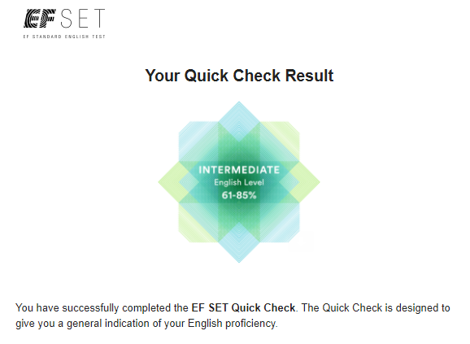

# Petr Isakov
## Contacts
 - **Location**: Omsk, Russian Federation
 - **Phone**: +7 908 101 22 87
 - **Telegram**: [@PetrIssakov](https://t.me/PetrIssakov)
 - **Email**: petrissakov@gmail.com
 - **GitGub**: petrissakov

## About Me
I have extensive experience in the telecommunications sector, worked as a network engineer for a long time. Cisco Certified Network Professional. Currently I am working as a database and NMS administrator. In my work, I widely use Python as an automation tool. In my free time I write telegram bots as my own projects. There is a strong desire to try  myself as Developer

## Skills
- Network Technologies *(TCP/IP stack, routing protocols: BGP IS-IS OSPF, etc.)*
- SQL
- Python
- Bash, Powershell
- Linux hosts administration

## Code Example
```
def multiply(a,b):
    return a*b
```

## Education
- **University**: North Kazakhstan State University Bachelor's degree, Computer networking and telecommunication
- **Courses**: 
    - CCNP (networking)
    - [Python for network engineers](https://buildmedia.readthedocs.org/media/pdf/pyneng/latest/pyneng.pdf)

## English
Accordingly **EF SET Quick Check** my level of English is between B1 Intermediate and B2 Upper Intermediate

